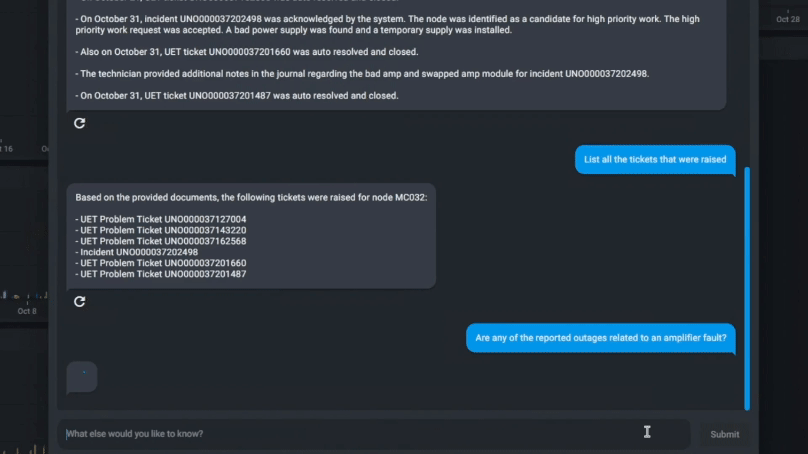

# AWS LLM Gateway

Project ACTIVE as of May 15, 2024

## Project Overview

This project provides sample code and CDK for deploying APIs which provide a secure and scalable interface with Amazon Bedrock.

This project allows users to deploy either a standard REST API, *or* a WebSocket API which supports streaming responses from Amazon Bedrock.

The difference between these 2 options is discussed in more detail below.

## Demo

This demo video shows an LLM chatbot powered by the AWS LLM Gateway and Bedrock Streaming. 
The chatbot in this demo helps mobile network technicians summarize information about network outages, using data fetched from a (No)SQL or vector database.



## How to deploy the backend

### REST API
1. Run the following commands:
   ```
   > cd <project_root>/cdk/  # Go to the CDK directory.
   > cp template.env .env    # Create your own .env file with all necessary parameters.
   ```
3. (Optional) If you want to use non-default settings for your project, edit the settings in your `.env` file. 
   You will need to at least need to set `ECR_REST_REPOSITORY` to the name that you chose for your repository in step # 2.
4. Run `export $(cat .env | xargs)` to export your `.env` file so that your settings can be read when you deploy your CDK stack.
5. Deploy the `LlmGatewayStack` stack inside CDK (`cdk deploy`).
6. If you need to make adjustments to your lambda code, re-run step (2) to
   deploy your docker image, and then manually edit the lambda to point to your
   ECR repository's new `*:latest` tag.

### WebSocket API


#### Creating your certificate

##### Domain and Certifcate, AWS Internal

1. Go to this page: https://supernova.amazon.dev/

2. Complete the following steps to create a Route53 HostedZone and domain for this project:
* Fill in the following:
    * Are you in AWS or CDO? , Select AWS
    * Select your organization, Select people
    * Owner Bindle ID, Input your Bindle id (find it here: Bindle UI)
    * Create a role using the instructions described here (https://w.amazon.com/bin/view/SuperNova/PreOnboardingSteps) and put that in the IAM Role ARN for SuperNova
    * Hosted Zone ID (Optional) , leave blank

3. Verify that a HostedZone has been created in Route53 -> Hosted zones
4. Complete the following steps to create an verify a certificate using the domain you just created
* Go to Certificate Manager (ACM) -> Request a certificate
* Select "Request a public certificate"
* In Fully qualified domain name, put in your domain (should be something like username.people.aws.dev)
* Click "Add another name to this Certficate", and add a sub domain (should be something like dashboard.username.people.aws.dev)
* Click "Request"
5. Go to your newly created certificate in AWS Certificate Manager -> Certificates, and click "Create records in Route 53"


##### Domain and Certificate, AWS Customer

1. Follow the instructions here to create a certificate with AWS Certificate Manager: https://docs.aws.amazon.com/acm/latest/userguide/gs-acm-request-public.html

2. Follow the instructions here to validate your domain ownership for your certificate: https://docs.aws.amazon.com/acm/latest/userguide/domain-ownership-validation.html


#### Azure Ad Authentication Steps (Optional)
1. Log in to the Azure Portal.
2. In the **Azure Services** section, choose **Azure Active Directory**.
3. In the left sidebar, choose **Enterprise applications**.
4. Choose **New application**.
5. On the **Browse Azure AD Gallery** page, choose **Create your own application**.
6. Under **What’s the name of your app?**, enter a name for your application and select **Integrate any other application you don’t find in the gallery (Non-gallery)**, as shown in <a href="https://d2908q01vomqb2.cloudfront.net/22d200f8670dbdb3e253a90eee5098477c95c23d/2021/11/09/Amazon-Cognito-federated-authentication-2.png" target="_blank">Figure 2</a>. Choose **Create**.

7. It will take few seconds for the application to be created in Azure AD, then you should be redirected to the **Overview** page for the newly added application.
**Note:** Occasionally, this step can result in a **Not Found** error, even though Azure AD has successfully created a new application. If that happens, in Azure AD navigate back to **Enterprise applications** and search for your application by name.
8. On the **Getting started** page, in the **Set up single sign on** tile, choose **Get started**, as shown in <a href="https://d2908q01vomqb2.cloudfront.net/22d200f8670dbdb3e253a90eee5098477c95c23d/2021/11/10/Amazon-Cognito-federated-authentication-3r.png" target="_blank">Figure 3</a>.
9. On the next screen, select **SAML**.
10. Scroll down to the SAML Signing Certificate section, and copy the App Federation Metadata Url by choosing the copy into clipboard icon (highlighted with red arrow in <a href="https://d2908q01vomqb2.cloudfront.net/22d200f8670dbdb3e253a90eee5098477c95c23d/2021/11/09/Amazon-Cognito-federated-authentication-6.png" target="_blank">Figure 6</a>). In your `.env` file, use this value for the `METADATA_URL_COPIED_FROM_AZURE_AD` variable
11. Complete the deployment steps in the `Deployment Steps` section of this ReadMe
12. In the output of the deployment stack, you will see `LlmGatewayStack.EntityId` and `LlmGatewayStack.ReplyURL`. Keep these in a text editor, as you'll need them in the next step.
13. Make sure you're back in the **SAML** page you were on in steps 9 and 10
14. In the middle pane under **Set up Single Sign-On with SAML**, in the **Basic SAML Configuration** section, choose the edit <a href="https://d2908q01vomqb2.cloudfront.net/22d200f8670dbdb3e253a90eee5098477c95c23d/2021/11/09/pencil2.png" target="_blank">icon</a>.
15. In the right pane under **Basic SAML Configuration**, replace the default **Identifier ID (Entity ID)** with the `LlmGatewayStack.EntityId` you copied previously. In the **Reply URL (Assertion Consumer Service URL)** field, enter the `LlmGatewayStack.ReplyURL` you copied previously, as shown in <a href="https://d2908q01vomqb2.cloudfront.net/22d200f8670dbdb3e253a90eee5098477c95c23d/2021/11/09/Amazon-Cognito-federated-authentication-4.png" target="_blank">Figure 4</a>. Choose **Save**.
16. In the middle pane under **Set up Single Sign-On with SAML**, in the **User Attributes & Claims** section, choose **Edit**.
17. Choose **Add a group claim**.
18. On the **User Attributes & Claims** page, in the right pane under **Group Claims**, select **Groups assigned to the application**, leave **Source attribute** as **Group ID**, as shown in <a href="https://d2908q01vomqb2.cloudfront.net/22d200f8670dbdb3e253a90eee5098477c95c23d/2021/11/09/Amazon-Cognito-federated-authentication-5.png" target="_blank">Figure 5</a>. Choose **Save**.
19. Go to the url in the `LlmGatewayStack.StreamlitUiUrl` stack output, and you should be prompted to log in using your AzureAd credentials. Make sure you have added the user you want to log-in with to the application you created in steps 4-6 (Within the application, go to **Users and groups** -> **Add user/group** and then add your desired users)

#### GitHub Authentication Steps (Optional)
1. Follow steps 1, 2, and 3 in `Deployment Steps` below
2. Create a GitHub OAuth App (<a href="https://docs.github.com/en/apps/oauth-apps/building-oauth-apps/creating-an-oauth-app" target="_blank">instructions</a>.), with the following settings:
* Authorization callback URL: https://<`COGNTIO_DOMAIN_PREFIX`>.auth.`<Your AWS Region>`.amazoncognito.com/oauth2/idpresponse
* Note down the Client ID and Secret. Put the Client ID in `GIT_HUB_CLIENT_ID` in your `.env` file, and the Secret in `GIT_HUB_CLIENT_SECRET` in your `.env` file
3. GitHub is not natively supported by Cognito, so it needs a proxy for it to work. Clone this repo, and follow step `2a: Deployment with lambda and API Gateway` https://github.com/TimothyJones/github-cognito-openid-wrapper
4. Once you have finished deploying the proxy, one of its stack outputs will be `GitHubShimIssuer`, which will be a url. Put that url in `GIT_HUB_PROXY_URL` in your `.env` file
5. Continue with steps 4-12 in `Deployment Steps` below

#### Deployment Steps

1. `cd` into `cdk`
2. Run `cp template.env .env`
3. Set `COGNTIO_DOMAIN_PREFIX` to a globally unique alphanumeric string
4. In your new `.env` file, make sure `API_GATEWAY_TYPE` is set to `"websocket"`.
5. Set the `UI_CERT_ARN` to the ARN of the certificate you created in the `Creating your certificate` section of this ReadMe.
6. Set the `UI_DOMAIN_NAME` to the sub domain you created in the `Creating your certificate` section of this ReadMe.
7. If you want to use OpenAI LLMs, make sure to populate `API_KEY` with your OpenAI api key
8. If you want to use AzureAd for authentication, follow the steps in the `Azure Ad Authentication Steps` section of this ReadMe and make sure to populate the `METADATA_URL_COPIED_FROM_AZURE_AD` in your `.env` file
9. Run `./deploy.sh`
10. If you need to make adjustments to your lambda code, simply re-run `./deploy.sh`
11. If you are using AzureAd for authentication, skip this step. To use Cognito Authentication against the API Gateway WebSocket, you'll need a Cognito user. Create one with your desired username and password with the `python3 create_cognito_user.py` script. Once you do that, Streamlit will automatically use the user you created to authenticate to the API Gateway WebSocket.
12. Go to the url in the `LlmGatewayStack.StreamlitUiUrl` stack output

### Deployment settings

The following are settings which you can configure as needed for your project, along with the values they can take.

This information can also be found inside `<project_root>/cdk/template.env`.

```
API_GATEWAY_TYPE="websocket"          # "rest" or "websocket"
API_GATEWAY_USE_API_KEY="true"   # "true" or "false"
API_GATEWAY_USE_IAM_AUTH="true"  # "true" or "false"
DEFAULT_MAX_TOKENS="4096"
DEFAULT_TEMP="0.0"
ECR_WEBSOCKET_REPOSITORY="llm-gateway-ws"
API_KEY=""
# OPENSEARCH_DOMAIN_ENDPOINT=""  # Optional
```

## Uploading data for cached question-answer pairs

The LLM Gateway has the ability to immediately respond to questions which have been asked before, by using a cache of question-answer pairs which have been asked before.

This causes a significant reduction in latency for prompts which are sent to the API, and for which that prompt appears in the cache of question-answer pairs.

You can pre-populate this cache by bulk-uploading data to your DynamoDB index.

To do this:
1. Prepare a JSON file with all the data that you want to upload to DynamoDB.
    Each data item should be its own JSON object within a top-level JSON list.
    For example, your `.json` file should look as follows:
    ```
    [
        { pk: pk1, key1: value1, ... },
        { pk: pk2, key1: value1, ... },
        { pk: pk3, key1: value1, ... },
        ...
    ]
    ```
2. Run the script from the project root directory as follows. Please remember that you should have your AWS credentials working from your command line in order for this script to work. You may need to log in or provide environment variables.
```
python scripts/bulk_upload_JSON_to_DDB/bulk_upload_JSON_to_DDB.py <path_to_JSON_file> -t <table_name>
```

For more information, please run this command from the project root directory:
```
python scripts/bulk_upload_JSON_to_DDB/bulk_upload_JSON_to_DDB.py
```

## REST or WebSockets? What's the difference?

In general, users may find the faster response time and lack of timeouts which apply to a WebSocket API to be helpful than the benefits of a REST API. This means that human interfaces with the WebSocket API will be able to gradually present the AI assistant's response to a user in chunks. This will allow a user to start reading sooner, and understand if their question was successfully answered, and if it's being answered correctly. 

This may also make WebSocket APIs faster for developers to test, compared to a REST API.

However, it is important to note that as of 2023-Nov-27, WebSocket API Gateways don't support WAF integrations, Resource Policies, or VPC links.

| Feature                                                                      | REST                 | WebSockets |
| ---------------------------------------------------------------------------- |--------------------- | ---------- |
| Stream responses from the AI assistant in chunks                             | ❌ NO                | ✅ YES     |
| User can find out if the request failed before reaching the timeout?         | ❌ NO                | ✅ YES     |
| Users can cancel requests without waiting for a full response?<sup>[0]</sup> | ❌ NO                | ✅ YES     |
| Timeout (without API Gateway)                                                | 15 min               | 15 min     |
| Timeout (with API Gateway)                                                   | 30 s                 | 10 min     |
| API Gateway supports WAF                                                     | ✅ YES               | ❌ NO      |
| API Gateway supports Resource Policies                                       | ✅ YES               | ❌ NO      |
| API Gateway supports VPC links                                               | ✅ YES               | ❌ NO      |
| ---------------------------------------------------------------------------- | -------------------- | ---------- |
| Latency metric<sup>[1]</sup>                                                 | REST                 | WebSockets |
| ---------------------------------------------------------------------------- | -------------------- | ---------- |
| Anthropic Claude with 10,000 tokens                                          | 20 s                 | 3 s        |
| Anthropic Claude with 50,000 tokens                                          | > 30 s<sup>[2]</sup> | 5 s        |

<sup>[0]</sup> Not yet implemented in this project.

<sup>[1]</sup> Defined as "the time between when a user submits a request, and when they first receive a response from the API"

<sup>[2]</sup> Exceeds the REST API Gateway timeout of 30 seconds.


## Security
See [CONTRIBUTING](CONTRIBUTING.md#security-issue-notifications) for more information.

## License
This library is licensed under the MIT-0 License. See the LICENSE file.
