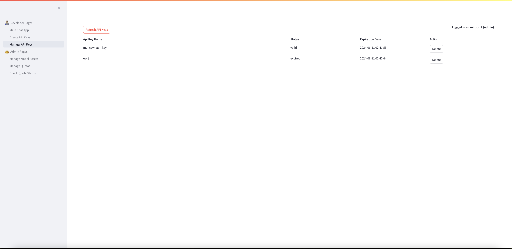

# AWS LLM Gateway

Project DEPRECATED as of December 20, 2024

Please check out genai-gateway here: https://github.com/aws-samples/genai-gateway  (This new project is built on top of LiteLLM, enabling us to provide a much larger list of features to our users. We are considering it to be llm-gateway 2.0, and it is actively under development)

## Project Overview

This project provides sample code and CDK for deploying APIs which provide a secure and scalable interface with Amazon Bedrock.

This project allows users to deploy a Rest API that supports streaming streaming responses from Amazon Bedrock through an OpenAI interface

It supports additional features such as:

* Authentication through Cognito, Azure Ad, and GitHub
* cost-based weekly usage quotas customized per user
* model access policies customized per user
* api keys generated by users and linked to the above quotas and policies for that user. Api keys have a customizable expriation date
* Admin roles who can specify quotas and policies, and Non-Admin roles who cannot
* Observability (logs all requests and their costs, quota exceeded events, and model access denied events)

## Demo

This demo video shows an LLM chatbot powered by the AWS LLM Gateway and Bedrock Streaming. 

This Demo video shows the OpenAI Client being used with an LLMGateway API Key to call the LLMGateway to use the Bedrock Claude Haiku LLM

## How to deploy the backend

### Creating your certificate

#### Domain and Certifcate, AWS Internal

1. Reach out to mirodrr for instructions on this

#### Domain and Certificate, AWS Customer

1. Follow the instructions here to create a certificate with AWS Certificate Manager: https://docs.aws.amazon.com/acm/latest/userguide/gs-acm-request-public.html

2. Follow the instructions here to validate your domain ownership for your certificate: https://docs.aws.amazon.com/acm/latest/userguide/domain-ownership-validation.html

3. You will need to make two certificates. They can both be for subdomains under a single domain you own. One will be for the LLMGateway UI (`UI_CERT_ARN` and `UI_DOMAIN_NAME` in your `.env` file), and the other will be for the LLMGateway API (`LLM_GATEWAY_CERT_ARN` and `LLM_GATEWAY_DOMAIN_NAME` in your `.env` file)

#### Azure Ad Authentication Steps (Optional)
1. Log in to the Azure Portal.
2. In the **Azure Services** section, choose **Azure Active Directory**.
3. In the left sidebar, choose **Enterprise applications**.
4. Choose **New application**.
5. On the **Browse Azure AD Gallery** page, choose **Create your own application**.
6. Under **What’s the name of your app?**, enter a name for your application and select **Integrate any other application you don’t find in the gallery (Non-gallery)**, as shown in <a href="https://d2908q01vomqb2.cloudfront.net/22d200f8670dbdb3e253a90eee5098477c95c23d/2021/11/09/Amazon-Cognito-federated-authentication-2.png" target="_blank">Figure 2</a>. Choose **Create**.

7. It will take few seconds for the application to be created in Azure AD, then you should be redirected to the **Overview** page for the newly added application.
**Note:** Occasionally, this step can result in a **Not Found** error, even though Azure AD has successfully created a new application. If that happens, in Azure AD navigate back to **Enterprise applications** and search for your application by name.
8. On the **Getting started** page, in the **Set up single sign on** tile, choose **Get started**, as shown in <a href="https://d2908q01vomqb2.cloudfront.net/22d200f8670dbdb3e253a90eee5098477c95c23d/2021/11/10/Amazon-Cognito-federated-authentication-3r.png" target="_blank">Figure 3</a>.
9. On the next screen, select **SAML**.
10. Scroll down to the SAML Signing Certificate section, and copy the App Federation Metadata Url by choosing the copy into clipboard icon (highlighted with red arrow in <a href="https://d2908q01vomqb2.cloudfront.net/22d200f8670dbdb3e253a90eee5098477c95c23d/2021/11/09/Amazon-Cognito-federated-authentication-6.png" target="_blank">Figure 6</a>). In your `.env` file, use this value for the `METADATA_URL_COPIED_FROM_AZURE_AD` variable
11. Complete the deployment steps in the `Deployment Steps` section of this ReadMe
12. In the output of the deployment stack, you will see `LlmGatewayStack.EntityId` and `LlmGatewayStack.ReplyURL`. Keep these in a text editor, as you'll need them in the next step.
13. Make sure you're back in the **SAML** page you were on in steps 9 and 10
14. In the middle pane under **Set up Single Sign-On with SAML**, in the **Basic SAML Configuration** section, choose the edit <a href="https://d2908q01vomqb2.cloudfront.net/22d200f8670dbdb3e253a90eee5098477c95c23d/2021/11/09/pencil2.png" target="_blank">icon</a>.
15. In the right pane under **Basic SAML Configuration**, replace the default **Identifier ID (Entity ID)** with the `LlmGatewayStack.EntityId` you copied previously. In the **Reply URL (Assertion Consumer Service URL)** field, enter the `LlmGatewayStack.ReplyURL` you copied previously, as shown in <a href="https://d2908q01vomqb2.cloudfront.net/22d200f8670dbdb3e253a90eee5098477c95c23d/2021/11/09/Amazon-Cognito-federated-authentication-4.png" target="_blank">Figure 4</a>. Choose **Save**.
16. In the middle pane under **Set up Single Sign-On with SAML**, in the **User Attributes & Claims** section, choose **Edit**.
17. Choose **Add a group claim**.
18. On the **User Attributes & Claims** page, in the right pane under **Group Claims**, select **Groups assigned to the application**, leave **Source attribute** as **Group ID**, as shown in <a href="https://d2908q01vomqb2.cloudfront.net/22d200f8670dbdb3e253a90eee5098477c95c23d/2021/11/09/Amazon-Cognito-federated-authentication-5.png" target="_blank">Figure 5</a>. Choose **Save**.
19. Go to the url in the `LlmGatewayStack.StreamlitUiUrl` stack output, and you should be prompted to log in using your AzureAd credentials. Make sure you have added the user you want to log-in with to the application you created in steps 4-6 (Within the application, go to **Users and groups** -> **Add user/group** and then add your desired users)

#### GitHub Authentication Steps (Optional)
1. Follow steps 1, 2, and 3 in `Deployment Steps` below
2. Create a GitHub OAuth App (<a href="https://docs.github.com/en/apps/oauth-apps/building-oauth-apps/creating-an-oauth-app" target="_blank">instructions</a>.), with the following settings:
* Authorization callback URL: https://<`COGNTIO_DOMAIN_PREFIX`>.auth.`<Your AWS Region>`.amazoncognito.com/oauth2/idpresponse
* Note down the Client ID and Secret. Put the Client ID in `GIT_HUB_CLIENT_ID` in your `.env` file, and the Secret in `GIT_HUB_CLIENT_SECRET` in your `.env` file
3. GitHub is not natively supported by Cognito, so it needs a proxy for it to work. Clone this repo, and follow step `2a: Deployment with lambda and API Gateway` https://github.com/TimothyJones/github-cognito-openid-wrapper (**IMPORTANT** The github-cognito-openid-wrapper allows all individuals with a github account to log into your app by default. To prevent this, you will have to fork the repo, and make edits in order to lock it down, and restrict access only to certain users)
4. Once you have finished deploying the proxy, one of its stack outputs will be `GitHubShimIssuer`, which will be a url. Put that url in `GIT_HUB_PROXY_URL` in your `.env` file
5. Continue with steps 4-12 in `Deployment Steps` below

#### Deployment Steps

1. `cd` into `cdk`
2. Run `cp template.env .env`
3. Set `COGNTIO_DOMAIN_PREFIX` to a globally unique alphanumeric string
5. Set the `UI_CERT_ARN` to the ARN of the first certificate you created in the `Creating your certificate` section of this ReadMe.
6. Set the `UI_DOMAIN_NAME` to the first sub domain you created in the `Creating your certificate` section of this ReadMe.
7. Set the `LLM_GATEWAY_CERT_ARN` to the ARN of the second certificate you created in the `Creating your certificate` section of this ReadMe.
8. Set the `LLM_GATEWAY_DOMAIN_NAME` to the second sub domain you created in the `Creating your certificate` section of this ReadMe.

9. If you want to use AzureAd for authentication, follow the steps in the `Azure Ad Authentication Steps` section of this ReadMe and make sure to populate the `METADATA_URL_COPIED_FROM_AZURE_AD` in your `.env` file
10. If you want to use GitHub for authentication, follow the steps in the `GitHub Authentication Steps` section of this ReadMe and make sure to populate `GIT_HUB_CLIENT_ID`, `GIT_HUB_CLIENT_SECRET`, and `GIT_HUB_PROXY_URL` in your `.env` file
11. In `ADMIN_LIST` in your `.env` file, specify a comma separated list of usernames that you want to have the admin role. The admin role allows you to create usage quotas and model access policies.
12. Edit any other settings you like. The full list of settings and what they do is below.
13. Run `./deploy.sh`
14. If you need to make adjustments to your lambda code, simply re-run `./deploy.sh`
15. If you are using AzureAd or GitHub for authentication, skip this step. To use Cognito Authentication against the API Gateway WebSocket, you'll need a Cognito user. Create one with your desired username and password with the `python3 create_cognito_user.py` script in the `scripts` folder. Once you do that, Streamlit will automatically use the user you created to authenticate to the LLM Gateway.
16. Go to the url in the `LlmGatewayStack.StreamlitUiUrl` stack output

#### Deployment settings

The following are settings which you can configure as needed for your project in your `.env` file

* `COGNTIO_DOMAIN_PREFIX` *(Required)* Globally unique alphanumeric string that acts as a prefix to your Cognito domain used for authentication
* `UI_CERT_ARN` *(Required)* The ARN of the first Amazon Certificate Manager Certificate that you created in the `Creating your certificate` of this ReadMe. Certificate for the UI.
* `UI_DOMAIN_NAME` *(Required)* The first sub domain you created in the `Creating your certificate` section of this ReadMe. Domain name for the UI.
* `LLM_GATEWAY_CERT_ARN` *(Required)* The ARN of the second Amazon Certificate Manager Certificate that you created in the `Creating your certificate` of this ReadMe. Certificate for the LLMGateway API.
* `LLM_GATEWAY_DOMAIN_NAME` *(Required)* The second sub domain you created in the `Creating your certificate` section of this ReadMe. Domain name for the LLMGateway API.
* `METADATA_URL_COPIED_FROM_AZURE_AD` *(Optional)* Field needed for Azure AD Authentication. Detailed in the `Azure Ad Authentication Steps` section of this ReadMe
* `GIT_HUB_CLIENT_ID` *(Optional)* Field needed for GitHub Authentication. Detailed in the `GitHub Authentication Steps` section of this ReadMe
* `GIT_HUB_CLIENT_SECRET` *(Optional)* Field needed for GitHub Authentication. Detailed in the `GitHub Authentication Steps` section of this ReadMe
* `GIT_HUB_PROXY_URL` *(Optional)* Field needed for GitHub Authentication. Detailed in the `GitHub Authentication Steps` section of this ReadMe
* `ADMIN_LIST` *(Optional)* Comma separated list of usernames that you want to have the admin role. The admin role allows you to create usage quotas and model access policies.
* `ECR_STREAMLIT_REPOSITORY` *(Required)* Name of the ECR Repository that will store the Streamlit UI Docker Container Image
* `ECR_API_KEY_REPOSITORY` *(Required)* Name of the ECR Repository that will store the API Key Management Lambda Function Docker Container Image
* `ECR_LLM_GATEWAY_REPOSITORY` *(Required)* Name of the ECR Repository that will store the LLMGateway API Docker Container Image
* `ECR_QUOTA_REPOSITORY` *(Required)* Name of the ECR Repository that will store the Usage Quota Management Lambda Function Docker Container Image
* `ECR_MODEL_ACCESS_REPOSITORY` *(Required)* Name of the ECR Repository that will store the Model Access Management Lambda Function Docker Container Image
* `LLM_GATEWAY_IS_PUBLIC` *(Required)* Whether or not the application load balancer that provides access to the LLMGateway API is accessible from the internet.
* `SERVERLESS_API` *(Required)* Whether or not the LLMGateway API is Serverless (Lambda) or not (Elastic Container Service (ECS)). Currently, streaming is not supported with Serverless.
* `DEFAULT_QUOTA_FREQUENCY` *(Required)* The default period over which usage quotas apply. Currently only supports `weekly`. This means a user's spending limit resets every week. Will eventually support other time periods.
* `DEFAULT_QUOTA_DOLLARS` *(Required)* The default amount of money in dollars every user can spend per week.
* `DEFAULT_MODEL_ACCESS` *(Required)* Comma separeated list of models every user will have access to by default
* `DEBUG` *(Required)* Set to true to enable additional logging

## How to use the UI

Once you have gone to the URL in `LlmGatewayStack.StreamlitUiUrl` from the stack output in the final step of the `Deployment Steps` section, you will enter the UI. Below are images of each of the pages, and what they do

### Developer Pages

#### Main Chat App

This is the page you will start on. On the right, you can select your provider (only Amazon Bedrock for now), and your LLM Model you want to use. The list of models you see is determined by your Model Access policy set by your admin. On the right you can also see your "Estimated usage for this week", showing you how close you are to exceeding your weekly usage quota, also set by your admin. When you make a request, you can see exactly how much that request cost in the bottom right metrics section

#### Create API Keys

This is the page where you can create an API key in order to use the LLMGateway from outside the main UI. You specify a name for the key, an expiration date (or set to never expire), and click `Create`. The key is not saved, so copy it down when it appears on the screen. You can use this API key with an OpenAI Client or tooling in the exact same way you would use a real OpenAI API key, but running against Bedrock.

#### Manage API Keys

This is the page where you can view your existing API keys, their status (valid or expired), and when they expire. You can also delete any keys you no longer want

### Admin Pages

These pages are Admin only. If you are not an Admin, they will not be visible to you, and the corresponding APIs will throw a 403 if you try to use them

#### Manage Model Access

This is the page where you can assign a policy to a specific user to determine what Models they can access. You type in the user's username, click `Submit`, and then choose from a multi-select drop down menu the models they can use. Then, you click `Save Changes`. If you'd like to restore the defaults for that user, you can click `Reset To Defaults`

#### Manage Quotas

This is the page where you can assign a usage quota to a specific user to determine how much money they can spend per week. You type in the user's username, click `Submit`. Then, choose from a multi-select drop down menu the frequency of their quota (just weekly for now). Next, you choose the quota limit in dollars that they can spend each week. Finally, you click `Save Changes`. If you'd like to restore the defaults for that user, you can click `Reset To Defaults`

#### Check Quota Status

This is the page where you can see how close a user is to exceeding their quota. You type in the user's username, click `Submit`. Then you can see details about their quota, how much of it they've consumed, and whether or not they've exceeded it.

## Adding a new Bedrock Model

To add a new Bedrock Model to the LLM Gateway API, you must do the following:

1. Add it to the list of supported models in `lambdas/gateway/api/models/bedrock.py`, in the `_supported_models` variable
2. Add the new model's pricing information to the pricing config in `lambdas/gateway/api/data/cost_db.csv`

Note: you can see the list of models that Bedrock supports by using `aws bedrock list-foundation-models` <a href="https://awscli.amazonaws.com/v2/documentation/api/latest/reference/bedrock/list-foundation-models.html" target="_blank">Documentation</a>

## Load Testing

This repo has some load testing scripts. These currently are only set up to be used with pure Cognito (without AzureAd or Github Auth enabled). Do the following to perform load testing:

1. Make sure `BENCHMARK_MODE` is set to `true` in your deployment config file. Benchmark mode deploys a fake Bedrock server and points the LLMGateway at it. This is useful if you want to test the scalability of the LLMGateway beyond your current Bedrock quota limits.
2. Also make sure that `METADATA_URL_COPIED_FROM_AZURE_AD`, `GIT_HUB_CLIENT_ID`, `GIT_HUB_CLIENT_SECRET`, and `GIT_HUB_PROXY_URL` are all empty.
3. Redeploy if needed.
4. Go to the `/load_testing` folder
5. Create a `config.json` file based on the `config.template.json`. You can get the `client_secret` by going to your userpool in Amazon Cognito in the AWS Console, going to the `App Integration` tab, clicking on the `ApplicationLoadBalancerClient` at the bottom of the page, and then copying the `Client secret`
6. Run `python3 create_cognito_users.py <Number of desired users>`. This will create Cognito users which will call the LLM Gateway during the load test 
7. Run `python3 create_api_keys.py`. This will create LLM Gateway API keys for each of your created Cognito users
8. Run `locust -f llm_gateway_load_testing.py --headless -u  <Number of desired users> -r <Number of users to instantiate per second> --run-time <Runtime e.g. 1h>`. See <a href="https://docs.locust.io/en/stable/" target="_blank">Locust Documentation</a> for more details

## Security
See [CONTRIBUTING](CONTRIBUTING.md#security-issue-notifications) for more information.

## License
This library is licensed under the MIT-0 License. See the LICENSE file.
